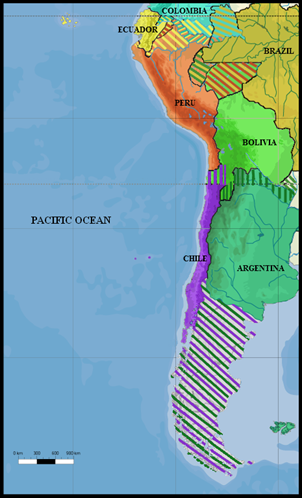

#¿Why Is Chile So Long? – Tomás Pueyo 

[Reportaje](https://unchartedterritories.tomaspueyo.com/p/why-is-chile-so-long) 

El reportaje comienza narrando por qué Chile es un país tan largo, ilustrándolo en que se pueden apilar una docena de países europeos a lo largo de su norte a sur. Luego habla de sus climas, profundizando en sus bosques y desiertos. Además, añade contexto histórico sobre la guerra con Bolivia y Perú en 1879, donde se disputaban estos territorios:

Como bien sabemos, seguimos teniendo esos territorios tras nuestro triunfo en la Guerra del Pacífico. 

Me pareció atractivo el tema y creo que lo logran presentar de una manera novedosa y que llame la atención. Me gustó en especial el primer video en donde cuentan que Chile es un país curvo. También me pareció interesante la animación de las montañas cuando narra acerca de la cordillera de los Andes. Creo que la información está concisa y las imágenes son un excelente complemento como herramienta para narrar la historia, sin aburrir o colapsar la información con tanto que leer. 

Aún así, me pareció que le faltó más elementos interactivos, como videos que se asemejaran al primero que utilizó. Creo que a pesar de que las imágenes son buenas, se ve muy estático todo. Me faltó movimiento, sobre todo porque ese movimiento ayuda a entender mejor y a querer seguir leyendo. 

A grandes rasgos el trabajo tiene un buen efecto a la hora de transmitir información, presenta los datos de manera concisa, ordenada y con imágenes. Lo que sí creo es que no cumplió tanto con el propósito de contar la historia de manera interactiva y mucho menos didáctica, si no que fue narrada de una forma más ilustrativa, que también aporta a querer seguir leyendo, pero no llama la atención. 

Para dar un ejemplo, en la parte en la que habla de la Guerra del Pacífico en que muestra que territorios se estaban disputando, podría haber incluido una animación que te “acercara” a esos territorios específicos con incluso barcos de guerra y banderas de los países implicados en medio. En vez de eso, solo incluye una fotografía del mapa con los territorios en disputa pintados de diferentes colores. 

Otro elemento que a mí me gusta mucho en este tipo de trabajos y que no estuvo presente en “¿Why Is Chile So Long” es el uso de sonidos. Me parece que eso habría sido un gran aporte y calzaba perfecto con la temática de este trabajo. Por ejemplo, en la parte en la que habla del clima, podríamos haber escuchado un bosque lluvioso o el viento seco de un desierto.  

Para concluir, creo que el autor del trabajo logró juntar toda la información y ponerla de forma resumida y clara, sin enredar al lector y entregándole la información precisa y exacta de lo que necesita saber. Pero al tener información concisa debería haberlo acompañado con más elementos interactivos; videos, animaciones, sonidos o incluso música podría haberle entregado mucho más valor al trabajo. 

Colomba Bolognesi Raineri 